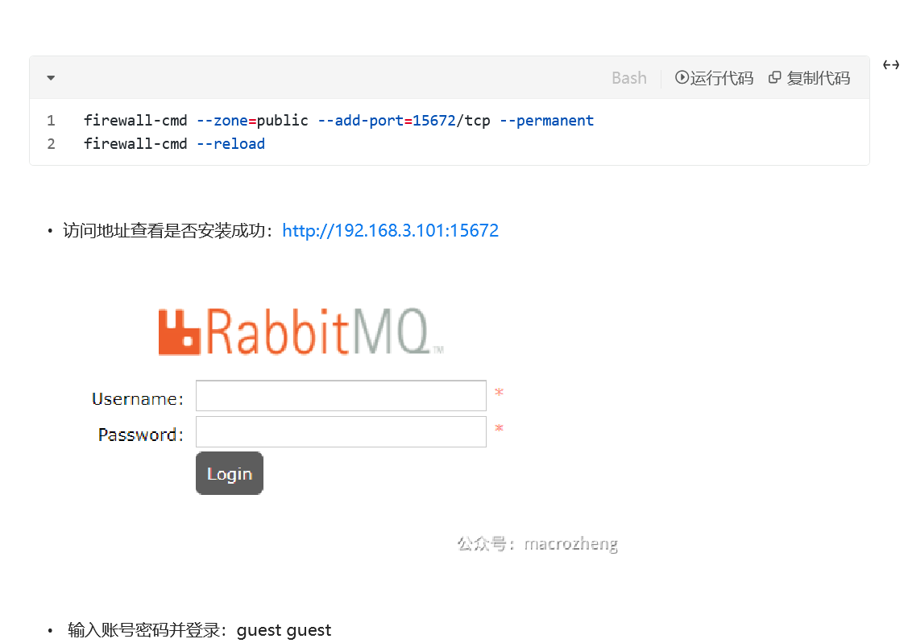
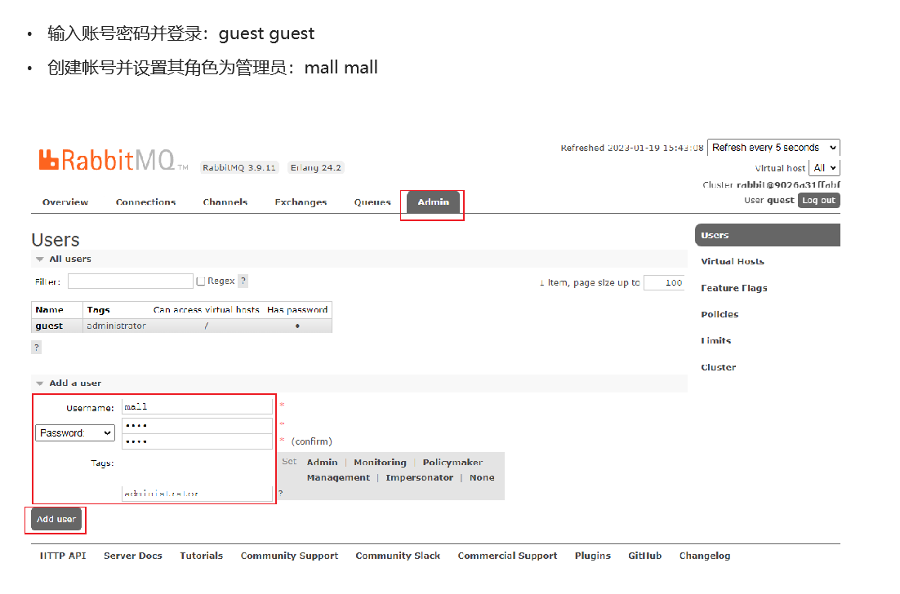
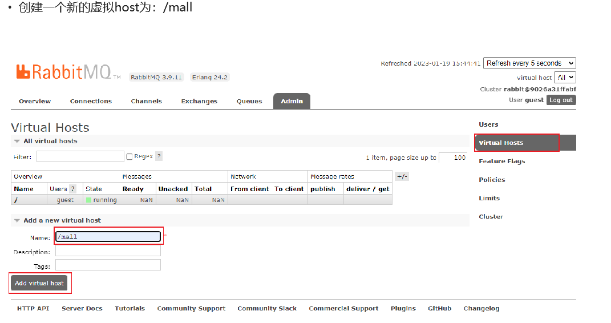
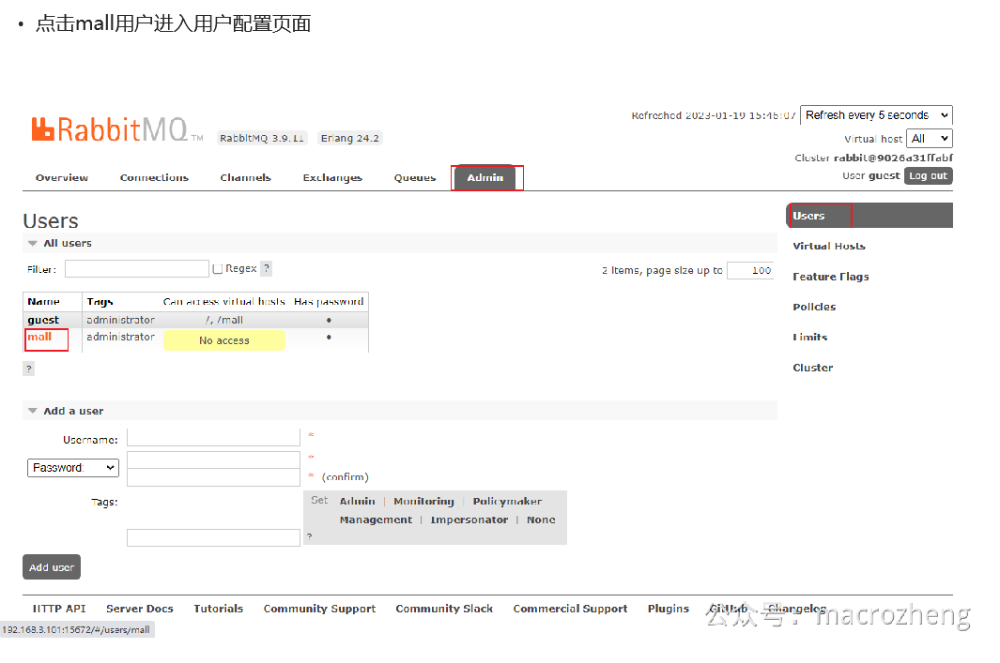
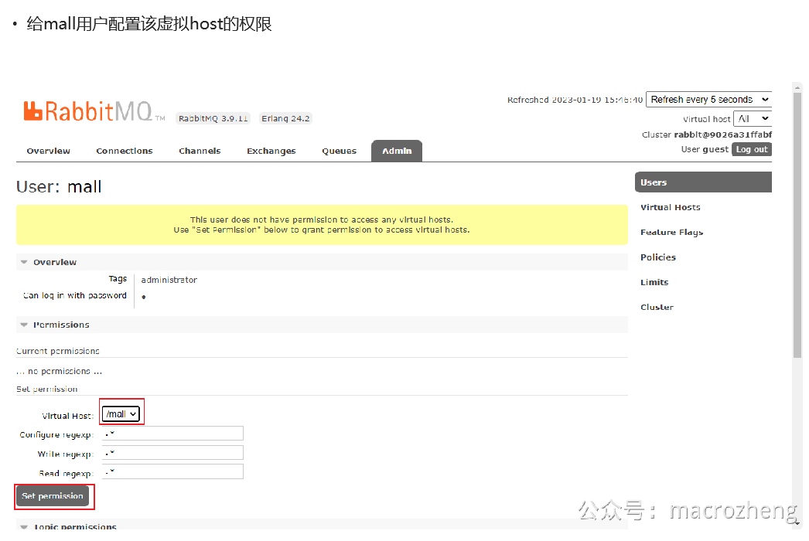

# Docker 环境

## 1.mysql

```
docker run -p 3306:3306 --name mysql \
--restart=always \
--network=mall-swarm-net \
-v /root/app/mall-swarm/mysql/log:/var/log/mysql \
-v /root/app/mall-swarm/mysql/data:/var/lib/mysql \
-e MYSQL_ROOT_PASSWORD=root  \
-d mysql:5.7
```

初始连接mysql的用户和密码


配置mall.sql

```
docker cp /mydata/mall.sql mysql:/
use mall;/
source /mall.sql;
```

**创建一个** `reader:123456`帐号并修改权限，使得任何ip都能访问：

```
grant all privileges on *.* to 'reader' @'%' identified by '123456';
flush privileges;
```

## 2.redis

```
docker pull redis:7

docker run -p 6379:6379 \
--restart=always \
--privileged \
--network=mall-swarm-net \
--name redis \
-v /root/app/mall-swarm/redis/data:/data \
-d redis:7 redis-server --appendonly yes
```

**进入Redis容器使用** `<span class="ne-text">redis-cli</span>`命令进行连接：

```
docker exec -it redis redis-cli
```

## 3.Nginx

```
docker pull nginx:1.22
```

先运行一次容器（为了拷贝配置文件）：

```
docker run -p 80:80 --name nginx \
-v /root/app/mall-swarm/nginx/html:/usr/share/nginx/html \
-v /root/app/mall-swarm/nginx/logs:/var/log/nginx  \
-d nginx:1.22
```

将容器内的配置文件拷贝到指定目录：

```
docker container cp nginx:/etc/nginx /root/app/mall-swarm/nginx/
```

修改文件名称：(在nginx里面)

```
mv nginx conf
```

终止并删除容器：

```
cd docker stop nginx
docker rm nginx
```

使用如下命令启动Nginx服务：

```
docker run -p 80:80 --name nginx \
--restart=always \
--network=mall-swarm-net \
-v /root/app/mall-swarm/nginx/html:/usr/share/nginx/html \
-v /root/app/mall-swarm/nginx/logs:/var/log/nginx  \
-v /root/app/mall-swarm/nginx/conf:/etc/nginx \
-d nginx:1.22
```

## 4.RabbitMQ

```
docker run -p 5672:5672 -p 15672:15672 --name rabbitmq \
--restart=always \
--network=mall-swarm-net \
--hostname mall-rabbit \
-v /root/app/mall-swarm/rabbitmq/data:/var/lib/rabbitmq \
-d rabbitmq:3.9.11-management
```











## 5.Elasticsearch

```
docker pull elasticsearch:7.17.3
```

**修改虚拟内存区域大小，否则会因为过小而无法启动:**

```
sysctl -w vm.max_map_count=262144
```

```
docker run -p 9200:9200 -p 9300:9300 --name elasticsearch \
--restart=always \
--network=mall-swarm-net \
-e "discovery.type=single-node" \
-e "cluster.name=elasticsearch" \
-e "ES_JAVA_OPTS=-Xms512m -Xmx1024m" \
-v /root/app/mall-swarm/elasticsearch/plugins:/usr/share/elasticsearch/plugins \
-v /root/app/mall-swarm/elasticsearch/data:/usr/share/elasticsearch/data \
-d elasticsearch:7.17.3
```

**启动时会发现** `<span class="ne-text">/usr/share/elasticsearch/data</span>`目录没有访问权限，只需要修改 `<span class="ne-text">/mydata/elasticsearch/data</span>`目录的权限，再重新启动即可；

```
chmod 777 /root/app/mall-swarm/elasticsearch/data
```

**安装中文分词器IKAnalyzer，注意下载与Elasticsearch对应的版本，下载地址：**[https://github.com/medcl/elasticsearch-analysis-ik/releases](https://github.com/medcl/elasticsearch-analysis-ik/releases)

**下载完成后解压到Elasticsearch的** `/root/app/mall-swarm/elasticsearch/plugins`目录下

登入网站：[http://192.168.3.101:9200](http://192.168.3.101:9200)

## 6.Logstash

```
docker pull logstash:7.17.3

```

**修改Logstash的配置文件** `<span class="ne-text">logstash.conf</span>`中 `<span class="ne-text">output</span>`节点下的Elasticsearch连接地址为 `<span class="ne-text">es:9200</span>`，配置文件地址：[https://github.com/macrozheng/mall-swarm/blob/teach/document/elk/logstash.conf](https://github.com/macrozheng/mall-swarm/blob/teach/document/elk/logstash.conf)

```
output {
  elasticsearch {
    hosts => "elasticsearch:9200"
    index => "mall-%{type}-%{+YYYY.MM.dd}"
  }
}
```

**创建** `<span class="ne-text">/mydata/logstash</span>`目录，并将Logstash的配置文件 `<span class="ne-text">logstash.conf</span>`拷贝到该目录；

```
mkdir /root/app/mall-swarm/logstash
```

运行：

```
docker run --name logstash -p 4560:4560 -p 4561:4561 -p 4562:4562 -p 4563:4563 \
--restart=always \
--network=mall-swarm-net \
-v /root/app/mall-swarm/logstash/logstash.conf:/usr/share/logstash/pipeline/logstash.conf \
-d logstash:7.17.3
```

## 7.Kibana

```
docker pull kibana:7.17.3
```

```
docker run --name kibana -p 5601:5601 \
--restart=always \
--network=mall-swarm-net \
-e "elasticsearch.hosts=http://elasticsearch:9200" \
-d kibana:7.17.3
```

**访问地址进行测试：**[http://192.168.3.101:5601](http://192.168.3.101:5601)

## MongoDB

```
docker pull mongo:4
```

```
docker run -p 27017:27017 --name mongo \
--restart=always \
--network=mall-swarm-net \
-v /root/app/mall-swarm/mongo/db:/data/db \
-d mongo:4
```

## MiniO

```
docker pull minio/minio
```

```
docker run -p 9090:9000 -p 9001:9001 --name minio \
--restart=always \
--network=mall-swarm-net \
-v /root/app/mall-swarm/minio/data:/data \
-e MINIO_ROOT_USER=minioadmin \
-e MINIO_ROOT_PASSWORD=minioadmin \
-d minio/minio server /data --console-address ":9001"
```

**注意使用** `<span class="ne-text">--console-address</span>`指定MinIO Console的运行端口（否则会随机端口运行）

## Nacos

```
docker pull nacos/nacos-server:v2.3.0
```

```
docker run -p 8848:8848 -p 9848:9848 --name nacos-registry \
--restart=always \
--network=mall-swarm-net \
-e MODE=standalone  \
-d nacos/nacos-server:v2.3.0
```
