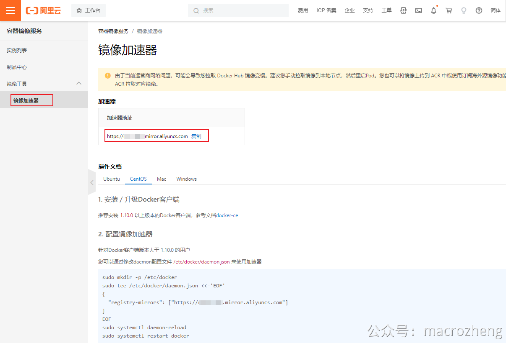

# 阿里云加速


* **首先我们需要登录阿里云，然后打开** `<span class="ne-text">控制台->容器镜像服务->镜像工具->镜像加速器</span>`功能，复制加速器地址；




* **然后使用vim编辑Docker的** `<span class="ne-text">daemon.json</span>`配置文件；
  ```
  vim /etc/docker/daemon.json
  ```


* **配置好加速器地址；**

```
{
  "registry-mirrors": ["https://xxx.mirror.aliyuncs.com"]
}
```

---


* **然后重启Docker服务即可应用。**
  ```
  systemctl daemon-reload
  systemctl restart docker
  ```

---
