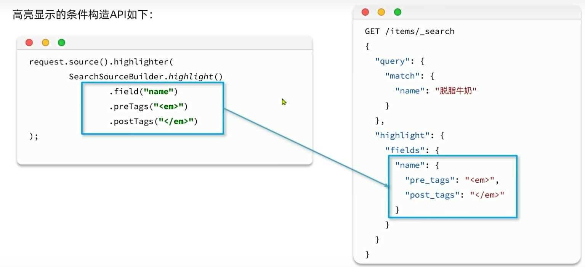
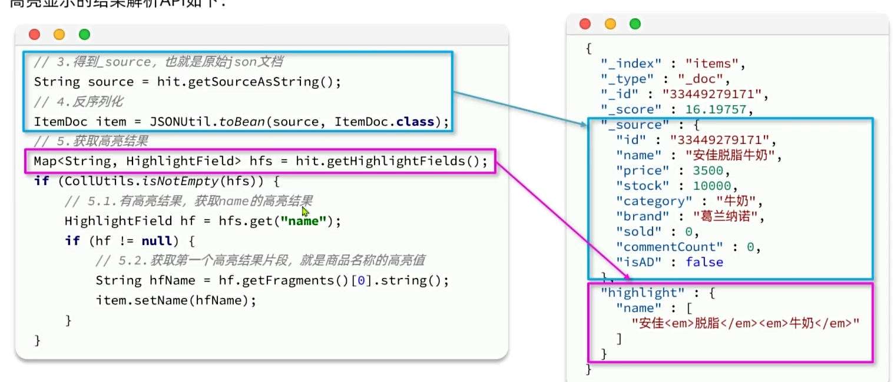

# 初始ElasticSearch

## 认识和安装


elasticsearch结合kibana、Logstash、Beats，是一整套技术栈，被叫做ELK被广发应用在日志数据分析、实时监控领域。


1.通过docker安装

```
docker run -d \
  --name es \
  -e "ES_JAVA_OPTS=-Xms512m -Xmx512m" \
  -e "discovery.type=single-node" \
  -v es-data:/usr/share/elasticsearch/data \
  -v es-plugins:/usr/share/elasticsearch/plugins \
  --privileged \
  --network hm_net \
  -p 9200:9200 \
  -p 9300:9300 \
  elasticsearch:7.12.1
```

2.通过docker安装Kibana

```
docker run -d \
--name kibana \
-e ELASTICSEARCH_HOSTS=http://es:9200 \
--network=hm_net \
--restart=always \
-p 5601:5601  \
kibana:7.12.1
```

## 倒排索引

传统数距库(如MySQL)采用正向索引，例如下表


elasticsearch采用倒排索引：

- 文档(document)：每条数据就是一个文档
- 词条(term)：文档按照语义分成的词语


## IK分词器

IK分词器是林良益在2006年开源发布的，其采用的正向迭代最细粒度切分算法一直沿用至今。

安装方法就是下载：https://github.com/medcl/elasticsearch-analysis-ik/releases/download/v7.12.1/elasticsearch-analysis-ik-7.12.1.zip

或者：https://release.infinilabs.com/analysis-ik/stable/

并将该Ik移动到es-plugins卷中


改用分词器：“ik_smart”


扩展ik分词器的字典


## 基础概念


# 索引库操作

## Mapping映射属性

mapping是对索引库中文档的约束，常见的mapping属性包括：

- type：字段数据类型，常见的简单类型有：

  - 字符串：text(可分词的文本)、keyword(精确值，例如：品牌、国家、ip地址)
  - 数值：long、integer、short、byte、double、float
  - 布尔：boolean
  - 日期：date
  - 对象：object
- index：是否创建索引，默认为true
- analyzer：使用那种分词器
- properties：字段的子字段

## 索引库操作


1.创建索引库和mapping的请求语法如下：

索引库的增删查

```
# 创建索引库并设置mapping映射
PUT /heima
{
  "mappings": {
    "properties": {
      "info": {
        "type": "text",
        "analyzer": "ik_smart"
      },
      "age": {
        "type": "byte"
      },
      "email": {
        "type": "keyword",
        "index": false
      },
      "name": {
        "type": "object",
        "properties": {
          "firstName": {
            "type": "keyword"
          },
          "lastName": {
            "type": "keyword"
          }
        }
  
      }
    }
  }
}

# 查询索引库
GET /heima

#删除索引库
DELETE /heima
```

索引库和mapping一旦创建成功，就无法修改。但是可以添加新的字段，语法如下：

```
PUT /索引库名/_mapping
{
   "properties": {
     "新字段名": {
       "type": "integer"
     }
   }
}
```

# 文档操作

## 文档的CRUD

新增文档的请求格式如下：


```
# 新增文档
POST /heima/_doc/1
{
  "info": "黑马程序员Java讲师",
  "email": "zy@itcast.cn",
  "name": {
    "firstName": "云",
    "lastName": "赵"
  }
}

# 查序文档
GET /heima/_doc/1

# 删除文档

DELETE /heima/_doc/1
```

修改操作

```
# 全量修改
PUT /heima/_doc/1
{
  "info": "黑马程序员Java讲师",
  "email": "zy@itcast.cn",
  "name": {
    "firstName": "四",
    "lastName": "了"
  }
}

# 增量修改
POST /heima/_update/1
{
  "doc": {
    "email": "ZhaoYun@cn"
  }
}

```

## 批量操作

Elasticsearch中允许通过一次请求中携带多次文档操作，也就是批量处理，语法格式如下：


# JavaRestClient

## 客户端初始化


在导包时注意版本，可以在其父工程上配置版本，直接写版本会被覆盖掉


## 商品Mapping映射

我们实现商品搜索，那么索引库的字段肯定要满足页面搜索的需求：


```
PUT /items
{
  "mappings": {
    "properties": {
      "id": {
        "type": "keyword"
      },
      "name": {
        "type": "text",
        "analyzer": "ik_smart"
      },
      "price": {
        "type": "integer"
      },
      "image": {
        "type": "keyword",
        "index": false
      },
      "category": {
        "type": "keyword"
      },
      "brand": {
        "type": "keyword"
      },
      "sold": {
        "type": "integer"
      },
      "commentCount": {
        "type": "integer",
        "index": false
      },
       "isAd": {
        "type": "boolean",
      },
       "updateTime": {
        "type": "date",
      },
  
    }
  }
}
```

## 索引库操作

创建索引库的JavaAPI与Restful接口对比：


## 文档操作

新增文档的JavaAPI如下：


## 批处理


# DSL查询

Elasticsearch提供了DSL(Domain Specific Language) 查询，以Json格式


## 快速入门

基于DSL的查询语法如下：


## 叶子查询

叶子查询还可以进一步细分，常见的有：

- 全文检索（full text）查询：利用分词器对用户输入内容分词，然后去词条列表中匹配。例如：

  - match_query
  - multi_match_query

  

  ```
  GET /items/_search
  {
    "query": {
      "match": {
        "name": "脱脂牛奶"
      }
    }
  }

  GET /items/_search
  {
    "query": {
      "multi_match": {
        "query": "脱脂牛奶",
        "fields": ["name"]
      }
    }
  }
  ```
- 精准查序：不对用户输入内容分词，直接精确匹配，一般是查找keyword、数值、日期、布尔登类型。例如：

  - ids
  - range
  - term

  

  ```
  GET /items/_search
  {
    "query": {
      "term": {
        "name": {
          "value": "脱脂牛奶"
        }
      }
    }
  }

  ```
- 地理（geo）查序：用于搜索地理位置，搜索

  - geo_distance
  - geo_bounding_box

## 复合查序

复合查序大致可以分为两类：

- 第一类：基于逻辑运算组合叶子查询，实现组合条件，例如：

  - bool

  

  ```
  GET /items/_search
  {
    "query": {
      "bool": {
        "must": [
          {
            "match": {
              "name": "智能手机"
            }
          }
        ],
        "filter": [
          {
            "term": {
              "brand": "华为"
            }
          },
          {
            "range": {
              "price": {
                "gte": 10,
                "lte": 20
              }
            }
          }
        ]
      }
    }
  }
  ```
- 第二类：基于某种算法修改查序时的文档相关性部分，从而改变文档排名。例如：

  - function_score
  - dis_max

## 排序和分页

elasticsearch支持对搜索结果排序，默认是根据相关度算分(_score)来排序，也可以指定字段排序，也可以指定字段排序。可以排序字段类型有：keyword类型、数值类型、地理坐标类型、日期类型。


```
GET /items/_search
{
  "query": {
      "match_all": {}
    }
  
  , "sort": [
    {
      "sold": "desc"
    },
    {
      "price": "asc"
    }
  ]
}
```

## 分页


## 深度分页问题

elasticsearch的数据一般会采用分片存储，也就是把一个索引中的数据分成N份，存储到不同节点上。查询数据时需要汇总各个分片数据。


查序越深，开销越大，数距库同样有这种问题。

ES提供了两种解决方案：

- search after：分页时要排序，原理时从上一次的排序开始，查序下一页数据。官方推荐使用的方法。（原理类似堆排序）
- scroll：原理时将排序数据形成快照，保存在内存。官方已经不再推荐使用


最终，form和size相加不能超过10000条

## 高亮显示


# JavaRestClient查序

## 快速入门

数据搜索的Java代码我们分为两部分：

- 构建并发起请求
- 解析查序结果


```
 @Test
    void testMatchAll() throws IOException {
        //1.创建request对象
        SearchRequest request = new SearchRequest("items");
        //2.配置request参数
        request.source()
                .query(QueryBuilders.matchAllQuery());
        //3.发起请求
        SearchResponse response = client.search(request, RequestOptions.DEFAULT);

        //4.解析结果
        SearchHits searchHits = response.getHits();
        //4.1总条数
        long total = searchHits.getTotalHits().value;
        //4.2命中的数据
        SearchHit[] hits = searchHits.getHits();
        for (SearchHit hit : hits) {
            //4.2.1获取source
            String json = hit.getSourceAsString();
            //4.2.2转为ItemDoc
            ItemDoc itemDoc = JSONUtil.toBean(json, ItemDoc.class);
        }
    }
```

## 构建查序条件

全文检索的查序条件构造API如下：


精确查序的查序条件构造API如下：


布尔查序的查序条件构造API如下：


```
void testSearch(){
        SearchRequest request = new SearchRequest("items");

        request.source().query(
          QueryBuilders.boolQuery()
                  .must(QueryBuilders.matchQuery("name","脱脂牛奶"))
                  .filter(QueryBuilders.termQuery("brand","德亚"))
                  .filter(QueryBuilders.rangeQuery("price").lt(3000))

        );
    }
```

## 排序和分页


## 高亮显示



注意高亮显示的结果并不在source中，而是在同一级的"highlight"中



# 数据聚合

聚合（aggregations）可以实现对文档数据的统计、分析、运算。聚合常见的有三类：

- 桶（Bucket）聚合：用来对文档做分组
  - TermAggregation：按照文档字段值分组
  - Date Histogram：按照日期阶段分组，例如一周为一组，或者一月为一组
- 度量(Metric)聚合：用以计算一些值，比如：最大值、最小值、平均值等
  - Avg：求平均值
  - Max：求最大值
  - Min：求最小值
  - Stats：同时求max、min、avg、sum等
- 管道（pipeline）聚合：其它聚合的结果为基础做聚合

## DSL聚合

桶聚合


除了对数据分组（Bucket）以外，我们还可以对每个Bucket内的数据进一步做数据计算和统计

例如：我想知道手机有哪些品牌，每个商品的价格最小值、最大值、平均值


## RestClient聚合


