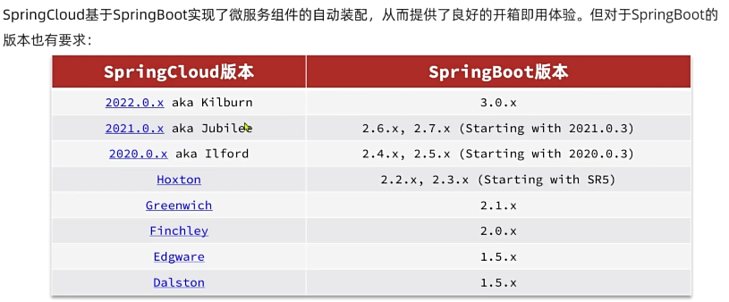

# 简介与版本对应



## SpringCloud的版本管理

1. 在SpringCloud项目中继承父工程

```
<parent>
        <groupId>org.springframework.boot</groupId>
        <artifactId>spring-boot-starter-parent</artifactId>
        <version>2.3.9.RELEASE</version>
</parent>
```

2. SpringCloud的主件的管理

```
 <dependencyManagement>
	<dependencies>
            <dependency>
                <groupId>org.springframework.cloud</groupId>
                <artifactId>spring-cloud-dependencies</artifactId>
                <version>${spring.cloud.version}</version>
                <type>pom</type>
                <scope>import</scope>
            </dependency>
	</dependencies>
</dependencyManagement>
```

s
