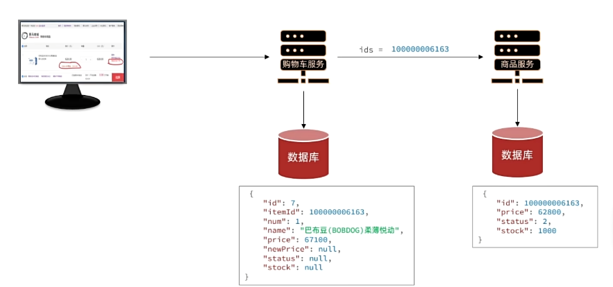
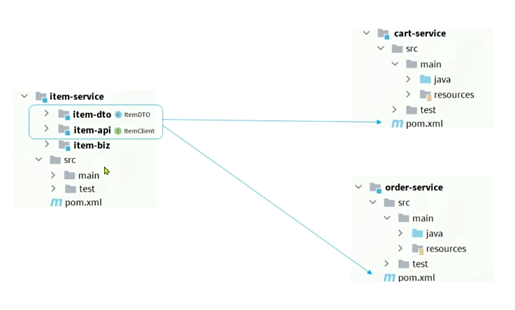
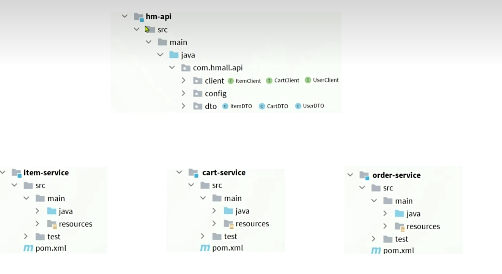

# 服务之间的通信

service之间也可以模仿前端像后端一样，在services之间发起网络请求。



## RestTemplate

Spring给我们提供了一个RestTemplate工具，可以方便的实现Http请求的发送。使用步骤如下：

1. 注入RestTemplate到Spring容器
2. 发起远程调用

1.注入bean

```java
@Bean
public RestTemplate restTemplate(){
    return new RestTemplate();
}
```

2.使用，与http请求一致

```java
//List<ItemDTO> items = itemService.queryItemByIds(itemIds);
ResponseEntity<List<ItemDTO>> reponse = restTemplate.exchange(
        "http://localhost:8081/items?ids={ids}",
HttpMethod.GET,
null,
new ParameterizedTypeReference<List<ItemDTO>>() {
        },
Map.of("ids", CollUtil.join(itemIds, ","))
);
if(!reponse.getStatusCode().is2xxSuccessful()){
    //查询失败
return;
}
List<ItemDTO> items = reponse.getBody();
```

# OpenFeign简介

上述方法操作起来太麻烦了，尽管借助nacos可以不将对应的ip地址写死。但还是太麻烦了

所以我们引入OpenFeign，它是一个声明式的http客户端，是SpringCloud在Eureka公司开源的Feign基础上改造而来。官方地址：https://github.com/OpenFeign/feign。其作用就是基于SpringMVC的常见注解，帮助我们优雅的实现http请求的发送。

## 快速入门

1.引入依赖，包括OpenFeign和负载均衡组件SpringCloudBalancer

```xml
 <!-- OpenFeign-->
        <dependency>
            <groupId>org.springframework.cloud</groupId>
            <artifactId>spring-cloud-starter-openfeign</artifactId>
        </dependency>
       <!-- 负载均衡-->
        <dependency>
            <groupId>org.springframework.cloud</groupId>
            <artifactId>spring-cloud-starter-loadbalancer</artifactId>
        </dependency>
```

2.通过@EnableFeignClients注解，启用OpenFeign功能

```java
@EnableFeignClients
@SpringBootApplication
public class CartApplication {
    public static void main(String[] args) {
        SpringApplication.run(CartApplication.class, args);
    }
}
```

建议编写api时要指定Clients的basePackages扫描包的位置

```
@EnableFeignClients(basePackages = "com.hmall.api") //指定扫描包
```


3.编写FeignClient

```java
@FeignClient("item-service")
public interface ItemClient {
    @GetMapping("/items")
    List<ItemDTO> queryItemByIds(@RequestParam("ids") List<Long> ids);
}

```

4.调用FeignClient

```java
List<ItemDTO> items = itemClient.queryItemByIds(itemIds);
```

## 连接池

OpenFeign对Http请求做了优雅的伪装，不过其底层发起http请求，依赖于它的框架。这些框架可以自己选择，包括以下三种：

- HttpURLConnection：默认实现，不支持连接池（效率低下）
- Apache HttpClient：支持连接池
- OKHttp：支持连接池

具体源码可以参考FeignBlockingLoadBalancerClient类中的delegate成员变量

### OpenFeign整合OKHttp的步骤如下：

1.引入依赖

```xml
<dependency>
    <groupId>io.github.openfeign</groupId>
    <artifactId>feign-okhttp</artifactId>
</dependency>
```

2.开启连接池功能

```java
feign:
  okhttp:
    enable: true
```

## 最佳实现

方案1：由被调用者，自己来维护暴露在外的接口（适合分项目微服务，耦合度低）



方案2：另外维护一个统一的api，适合聚会模块的项目。更简单，但耦合度较高



其中hm-api只需要引入这两个基础依赖

```
<dependency>
      <groupId>org.springframework.cloud</groupId>
      <artifactId>spring-cloud-starter-openfeign</artifactId>
</dependency>
       <!-- 负载均衡-->
<dependency>
     <groupId>org.springframework.cloud</groupId>
     <artifactId>spring-cloud-starter-loadbalancer</artifactId>
 </dependency>
```

不需要配置连接池功能，连接池功能需要调用远程服务的服务来具体情况具体配置

# 日志

OpenFeign只会在FeignClient所在的日志级别为DEBUG时，才会输入日志。而且其日志级别有4级

- NONE：不记录任何日志信息，这是**默认值**
- BASE：仅记录请求的方式，URL以及响应状态码和执行时间
- HEADERS：在BASIC的基础上，额外记录了请求和响应的头信息
- FULL：记录所有请求和响应的明细，包括头信息、请求体、元数据

因此我们要声明一个类型为Logger.Level的Bean，在其中定义日志级别：

```
import feign.Logger;
import org.springframework.context.annotation.Bean;
public class DefaultFeignConfig {
    @Bean
    public Logger.Level feignLoggerLevel(){
        return Logger.Level.FULL;
    }
}

```

此时这个Bean并未生效，想要配置某个FeignClient的日志，可以在@FeignClient注解中声明(局部配置)：

```
@FeignClient(value = "item-service",configuration = DefaultFeignConfig.class)
```

如果想要全局配置，让所有FeignClient都按照这个日志配置，则需要在@EnableFeignClients注解声明

```
@EnableFeignClients(basePackages = "com.hmall.api",defaultConfiguration = DefaultFeignConfig.class) 
```
