# 快速入门

1. 引入依赖

   ```
   <dependency>
       <groupId>com.baomidou</groupId>
       <artifactId>mybatis-plus-boot-starter</artifactId>
       <version>${mybatis.plus.version}</version>
   </dependency>
   ```

   该依赖还集成了Mybatis的starter，因此可以单引入这一个依赖就行
2. 定义Mapper
   自定义的Mapper继承MybatisPlus提供的BaseMapper接口：

```java
@Mapper
public interface ApArticleConfigMapper extends BaseMapper<ApArticleConfig> {
}
```

BaseMapper实现了如下方法

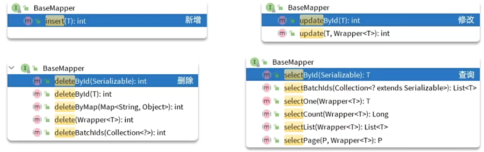

# 常见注解

MyBatisPlus通过扫描实体类，并基于发射获取实体类信息作为数距库表信息

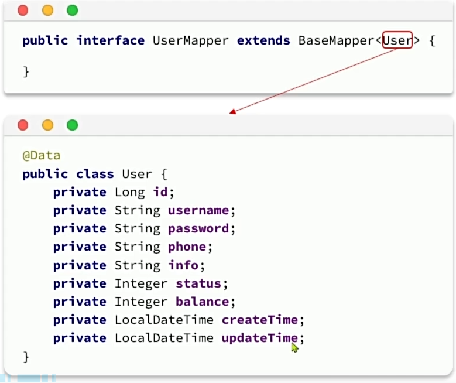

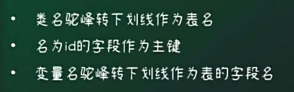

- @TableName：用来指定表名
- @TableId：用来指定表中的主键字段信息
- @TableField：用来指定表中的普通字段信息

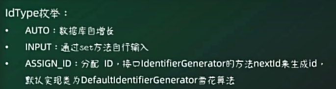

使用@TableField的常见场景：

- 成员变量与数据库字段名不一致
- 成员变量名以is开头，且是布尔值
- 成员变量名与数据库关键字冲突
- 成员变量不是数距库字段：@TableField(exist=false)

# 条件构造器

MyBatisPlus支持各种复杂的where条件

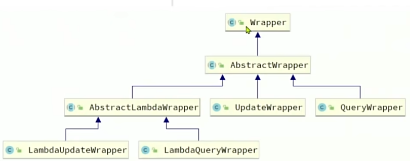

## 基于QueryWrapper的查序

需求：

```java
QueryWrapper<User> wrapper = new QueryWrapper<User>()
	.select("id","username","info","balance")
	.like("username","o")
	.ge("balance",1000)
```

上面的写法不太好，因为它写死了列明，使用LambdaQueryWrapper操作更好

```java
LambdaQueryWrapper<User> wrapper = new LambdaQueryWrapper<User>()
	.select(User::getId,User::getUsername,User::getInfo,User::getBalance)
	.like(User::getUsername,"o")
	.ge("User::getBalance,1000)
```

# 自定义SQL

我们可以利用MyBatisPlus的Wrapper来构造复杂的Where条件，然后自己定义SQL语句中剩下的部分

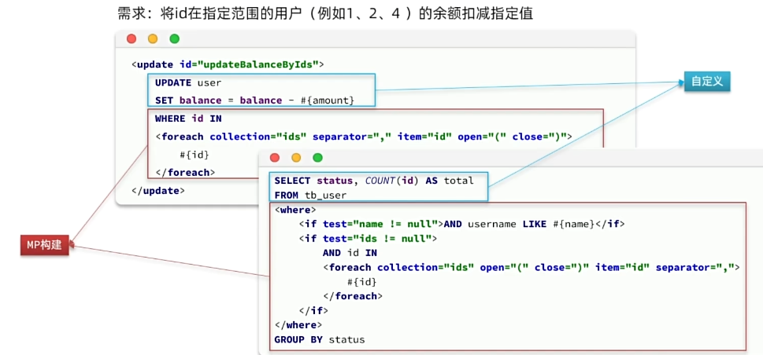

有时不能结合方便与查序条件的复杂：

1. 因此我们可以基于Wrapper构建where条件：

```java
List<Long> ids = List.of(1L,2L,4L);
int amount = 200;
LambdaQueryWrapper<User> wrapper = new LambdaQueryWrapper<User>().in(User::getId,ids);
//2.自定义SQL方法调用
userMapper.updateBalanceByIds(wrapper,amount);
```

2. 在mapper方法参数中用Param注解声明wrapper变量名称，必须是ew

```java
void updateBalanceByIds(@Paran("ew") LambdaQueryWrapper<User> wrapper,@Param("amount") int amount);
```

3. 自定义SQL，并用Wrapper条件：本质上是在拼接字段

```java
<update id = "updateBalanceByIds">
	UPDATE tb_user SET balance = balance-#{amount} ${ew.customSqlSegment} 
</update>
```

# IService接口

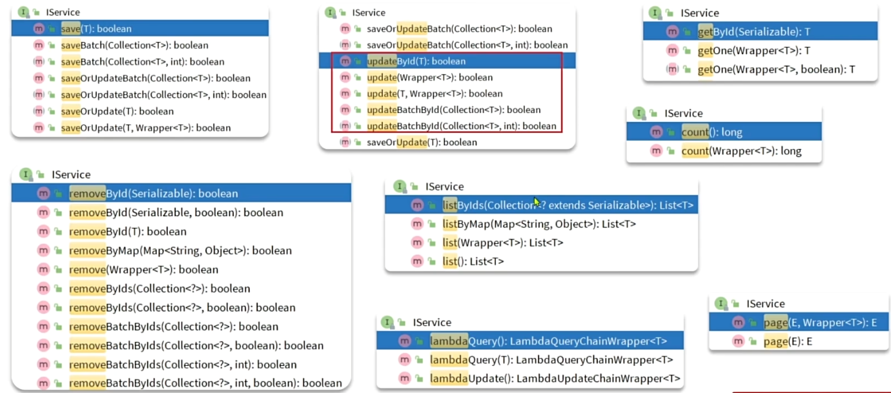

## 继承体系

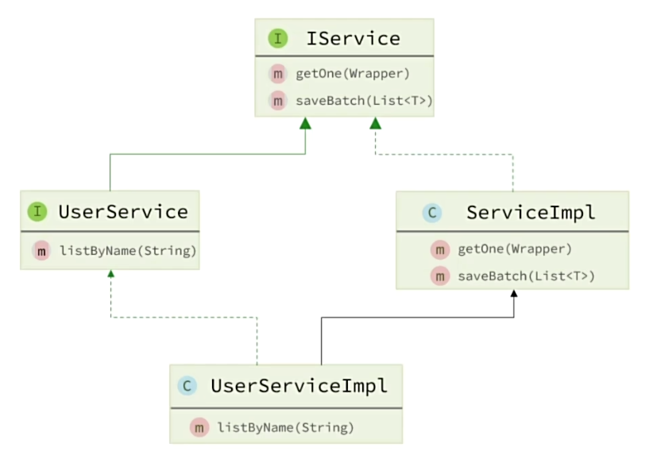

- IUserService

```java
public interface IUserService extends IService<User> {}
```

- UserServiceImpl

```java
puvlic class UserServiceImpl extends ServiceImpl<UserMapper,User> implememts IUserService{}
```

# 插件

## 代码生成

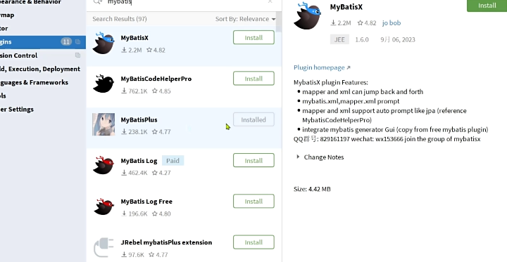

## 逻辑删除

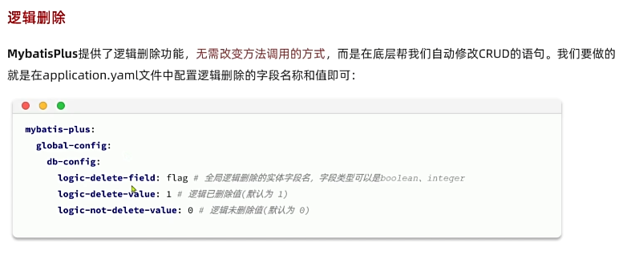

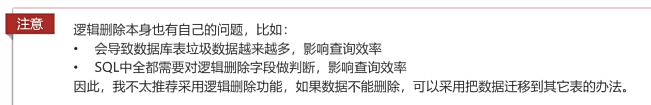

# 枚举处理器

User类中有一个用户状态字段：

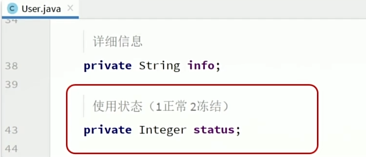

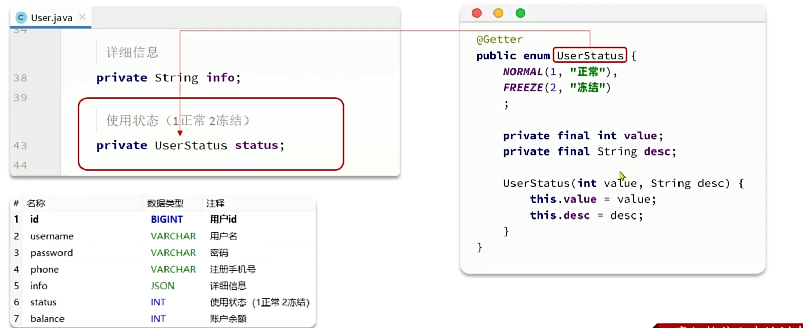

在aplication.yml中配置全局枚举处理器：

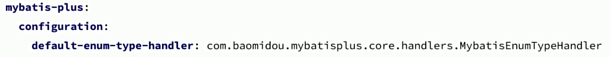

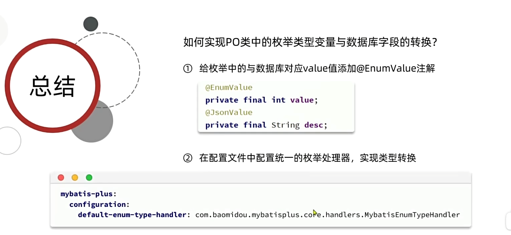
