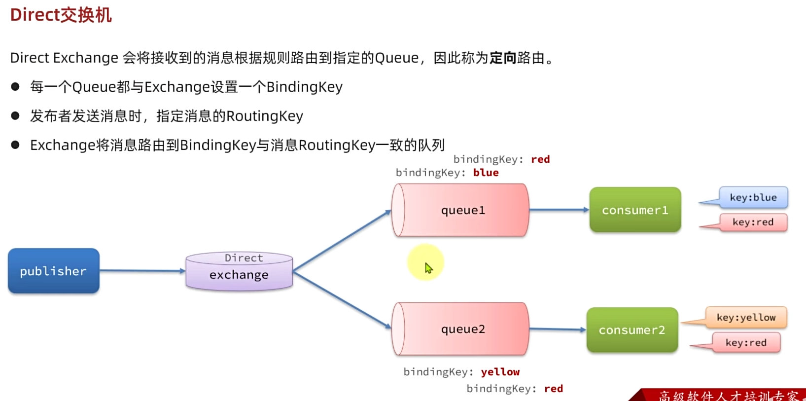
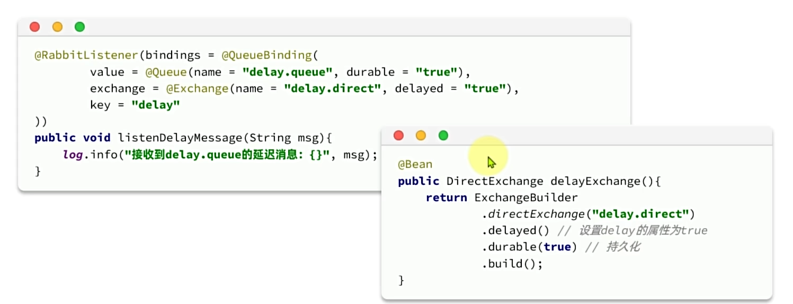

# 概述


# 基础篇

## 初试MQ

### 同步调用


### 异步调用


### MQ技术选型


## 快速入门

### 安装部署

官网地址[Rabbitmq](https://www.rabbitmq.com)

1.拉取docker镜像

```
docker pull rabbitmq:3.8-management
```

2.run

```
docker run \
 -e RABBITMQ_DEFAULT_USER=rabbitmq\
 -e RABBITMQ_DEFAULT_PASS=123456\
 -v mq-plugins:/plugins \
 --name mq \
 --hostname mq \
 -p 15672:15672 \
 -p 5672:5672 \
 --network hm_net\
 -d \
 rabbitmq:3.8-management
```

注意-v mq-plugins:/plugins \是要挂载到数据卷中，不映射

3.登入网站：http://192.168.200.130:15672/

### 基本概念


### 快速案例


1.在rabbit管理中添加队列


2.模拟发送消息过程


添加绑定


### 数据隔离


## java客户端mq操作

### 快速入门


1.引入spring-amqp依赖

```
 <!--AMQP依赖，包含RabbitMQ-->
        <dependency>
            <groupId>org.springframework.boot</groupId>
            <artifactId>spring-boot-starter-amqp</artifactId>
        </dependency>
```

2.在每个微服务中引入MQ服务端信息，这样微服务才能连接到RabbitMQ

```
spring:
  rabbitmq:
    host: 192.168.200.130
    port: 5672
    virtual-host: /hmall
    username: hmall
    password: 123456
```

3.发送消息

```
@SpringBootTest
class PublisherApplicationTest {
    @Autowired
    private RabbitTemplate rabbitTemplate;

    @Test
    public void testSimpleQueue(){
        //1.队列名
        String queueName ="simple.queue";
        String message = "hello,spring amqp";
        rabbitTemplate.convertAndSend(queueName,message);

    }

}
```

4.接收消息

```
@Slf4j
@Component
public class SpringRabbitListener {

    @RabbitListener(queues = "simple.queue")
    public void listenSimpleQueue(String message){
        log.info("监听到simple.queue的消息：{}",message);
}
}
```

总结


### WorkQueue

Work queues，任务模型。简单来说是让多个消费者绑定到一个队列，共同消费队列中的消息。


模拟WorkQueue方式


各个消费者共同处理对应的消息轮询的机制，加快消息处理速度。但是默认情况下，RabbitMQ会将消息依次轮询投递给绑定在队列上的每一个消费者。但这并没有考虑到消费者是否已经处理完消息，可能出现消息堆积。

因此我们需要修改application.yaml，设置preFetch值为1，确保同一时刻最多投递给消费者1条消息：

```
spring:
  rabbitmq:
    listener:
      simple:
        prefetch: 1
```

让消费者能者多劳

### Fanout交换机

交换机的作用主要是接收发送者发送的消息，并将其路由到与其绑定的队列中


小案例


```
 @Test
    public void testFanoutQueue(){
        //1.队列名
        String exchange ="hmall.fanout";

        String message = "hello,spring everyone";
        rabbitTemplate.convertAndSend(exchange,null,message);
    }
```

### Direct交换机



案例


```
  @Test
    public void testDirectQueue(){
        //1.队列名
        String exchange ="hmall.direct";

        String message = "hello,spring everyone";
        rabbitTemplate.convertAndSend(exchange,"red",message);
    }
```

### Topic交换机


案例


### 声明队列和交换机

SpringAMQP提供了几个类，用来声明队列，交换机及其绑定关系

- Queue：用于声明队列，可以用工厂类QueueBuilder构建
- Exchange：用于声明交换机，可以用工厂类ExchangeBuilder构建
- Binding：用于声明队列和交换机的绑定关系，可以用工厂类BindingBuilder构建


例如声明一个Fanout类型的交换机，并且创建队列与其绑定：

一般在消费者的微服务中写


```

```

这样声明还是太麻烦了，既然使用的SpringBoot，因此SpringAMQP提供了基于@RabbitListener注解来声明队列和交换机的方式：

```
 @RabbitListener(bindings = @QueueBinding(
            value = @Queue(name = "direct.queue1"),
            exchange = @Exchange(name = "hmall.direct",type = ExchangeTypes.DIRECT),
            key = {"red","blue"}
    ))
    public void listenDirectQueue1(String message){
        log.info("监听到fanout.queue1的消息：{}",message);
    }
```

### 消息转换器

 

在发送消息时，有默认使用jdk的序列化工具

```
 @Test
    public void testSendObject(){
        Map<String,Object> msg = new HashMap<>(2);
        msg.put("name","Jack");
        msg.put("password","123456");
        rabbitTemplate.convertAndSend("object.queue",msg);
    }
```

但是自带的转换器，有如下风险


在转换时，推荐使用json序列化的JDK转换器，需要做两件事：

1.在publisher和consumer中都要引入jackson依赖

```
<!--jackson-->
        <dependency>
            <groupId>com.fasterxml.jackson.core</groupId>
            <artifactId>jackson-databind</artifactId>
        </dependency>
```

2.在publisher和consumer中都要配置MessageConverter:

```
 @Bean
    public MessageConverter messageConverter(){
        return new Jackson2JsonMessageConverter();
    }
```

之后无需更改代码，其默认的转换器就会变为：Jackson2JsonMessageConverter()

### 业务改造


# 高级篇

消息可以靠性问题


## 发送者的可靠性

### 发送者重连

有的时候由于网络波动，可能会出现发送者连接MQ失败的情况。通过配置我们可以开启连接失败后的重连接失败后的重连机制（默认是关闭的）：

```
spring:
  rabbitmq:
    connection-timeout: 1s # 设置MQ的连接超时时间
    template:
      retry:
        enabled: true # 开启超时重试机制
        initial-interval: 1000ms # 失败后的初始等待时间
        multiplier: 1 # 失败后下次的等待时长倍数，下次等待时长 = initial-interval * multiplier
        max-attempts: 3 # 最大重试次数
```


### 发送者确认

SpringAMQP提供了Publisher Confirm和Publisher Return两种确认机制。开启确认机制后，当发送者发送消息给MQ后，MQ会返回确认结果给发送者。返回的结果有以下几种情况：


实现发送者确认

1.在publisher这个微服务的application.yaml中添加配置：

```
spring:
  rabbitmq:
    publisher-confirm-type: correlated # 开启publisher confirm机制，并设置confirm类型
    publisher-returns: true #开启publisher return机制

```

这里的publisher-confirm-type有三种模式：

- none：关闭confirm机制
- simple：同步阻塞等待MQ的回执消息
- correlated：MQ异步回调方式返回回执消息

2.每个RabbitTemplate只能配置一个ReturnCallback,因此需要在项目启动过程中配置：

```
@Slf4j
@AllArgsConstructor
@Configuration
public class MqConfig {
    private final RabbitTemplate rabbitTemplate;

    @PostConstruct
    public void init(){
        rabbitTemplate.setReturnsCallback(new RabbitTemplate.ReturnsCallback() {
            @Override
            public void returnedMessage(ReturnedMessage returned) {
                log.error("触发return callback,");
                log.debug("exchange: {}", returned.getExchange());
                log.debug("routingKey: {}", returned.getRoutingKey());
                log.debug("message: {}", returned.getMessage());
                log.debug("replyCode: {}", returned.getReplyCode());
                log.debug("replyText: {}", returned.getReplyText());
            }
        });
    }
}
```

3.发送消息，指定消息ID、消息ConfirmCallback

```
@Test
void testPublisherConfirm() {
    // 1.创建CorrelationData
    CorrelationData cd = new CorrelationData();
    // 2.给Future添加ConfirmCallback
    cd.getFuture().addCallback(new ListenableFutureCallback<CorrelationData.Confirm>() {
        @Override
        public void onFailure(Throwable ex) {
            // 2.1.Future发生异常时的处理逻辑，基本不会触发
            log.error("send message fail", ex);
        }
        @Override
        public void onSuccess(CorrelationData.Confirm result) {
            // 2.2.Future接收到回执的处理逻辑，参数中的result就是回执内容
            if(result.isAck()){ // result.isAck()，boolean类型，true代表ack回执，false 代表 nack回执
                log.debug("发送消息成功，收到 ack!");
            }else{ // result.getReason()，String类型，返回nack时的异常描述
                log.error("发送消息失败，收到 nack, reason : {}", result.getReason());
            }
        }
    });
    // 3.发送消息
    rabbitTemplate.convertAndSend("hmall.direct", "q", "hello", cd);
}
```

因为消息确认的消耗极大，如无必要不建议开启

### MQ的可靠性

在默认情况下，RabbitMQ会将接收到的信息保存在内存中以降低消息的延迟。这样会造成两个问题：

- 一旦MQ宕机，内存中的消息会丢失
- 内存空间有限，当消费者故障或处理过慢时，会导致消息积压，引发MQ阻塞


### 数据持久化

RabbitMQ实现数据持久化包括3个方面：

- 交换机持久化
- 队列持久化
- **消息持久化**


springmvc中发送的消息默认都是持久化的，可以自定义非持久化的消息

```
Message message = MessageBuilder.withBody("hello transient".getBytes(StandardCharsets.UTF_8))
                .setDeliveryMode(MessageDeliveryMode.NON_PERSISTENT)
                .build();

rabbitTemplate.convertAndSend("hmall.direct", "q", message);
```

### Lazy Queue

从RabbitMQ的3.6.0版本开始，就增加了Lazy Queue的概念，也就是惰性队列

惰性队列的特征如下：

- 接收到消息后直接存入磁盘，不再存储到内存
- 消费者要消费消息时才会从磁盘中读取并加载到内存(可以提前缓存部分消息到内容从，最多2048条)

在3.12版本后，所有的队列都是Lazy Queue模式，无法更改。

1.控制台更改


2.代码


## 消费者的可靠性

### 消费者确认机制


```
spring:
  listener:
    simple:
       prefetch: 1
       acknowledge-mode: auto # none,manual,auto
```

### 失败重试机制

SpringAMQP提供了消费者失败重试机制，在消费者出现异常时利用本地重试，而不是无限的requeue到mq。我们可以通过在application.yaml文件中添加配置来开启重试机制：

```
spring:
  rabbitmq:
    listener:
      simple:
        retry:
          enabled: true # 开启消费者失败重试
          initial-interval: 1000ms # 初识的失败等待时长为1秒
          multiplier: 1 # 失败的等待时长倍数，下次等待时长 = multiplier * last-interval
          max-attempts: 3 # 最大重试次数
          stateless: true # true无状态；false有状态。如果业务中包含事务，这里改为false
```


用某一个队列去存储错误的消息。

### 业务幂等性

幂等是一数学概念，用函数表达来描述是：f(x)=f(f(x))。在程序开发中，则是指同一业务，执行一次或多次对业务状态的影响是一致的。


#### 唯一消息ID

给每个消息都设置一个唯一的ID,利用id区分是否是重复消息

- 每一条消息都生成一个唯一的id，与消息一起投递给消费者
- 消费者接收到消息后处理自己的业务，业务处理成功后将消息ID保存到数据库
- 如果下次又收到相同的消息，去数距库中查询判断是否存在，存在则为重复消息放弃处理。

具体实现是在默认转换器中设置

```
@Bean
    public MessageConverter messageConverter(){
        Jackson2JsonMessageConverter jackson2JsonMessageConverter = new Jackson2JsonMessageConverter();
        jackson2JsonMessageConverter.setCreateMessageIds(true);
        return jackson2JsonMessageConverter;
    }
```

在listener中监听

```
 @RabbitListener(queues = "object.queue")
    public void listenObjectQueue3(Message message){
    
        log.info("监听到fanout.queue2的消息ID：{}",message.getMessageProperties().getMessageId());
    }
```

- 缺点：业务入侵，实现消耗大

#### 业务判断


### 总结


## 延迟消息

- 延迟消息：发送者发送消息时指定一个时间，消费者不会立刻收到消息，而是在指定时间之后才收到消息。
- 延迟任务：设置一定时间之后才执行的任务


### 死信交换机

当一个队列中的消息满足下列情况之一时，就会成为**死信（dead letter）:**

- 消费者使用basic.reject或basic.nack声明消费失败，并且消息的requeue参数设置为false
- 消息是一个过期消息（达到了进入队列或消息本身设置的过期时间），超时无人消费
- 要投递的队列消息堆积满了，最早的消息可能成为死信

如果队列通过dead-letter-exchange属性指定了一个交换机，那么该队列中的死信就会投递到这个交换机中。这个交换机称为**死信交换机**(Dead Letter Exchange,DLX)


上图非常巧妙的利用死信交换机，实现了延迟消息的功能

1.设置消费者与dlx.drect和dlx.queue的连接

```

    //仅仅接收死信交换机的消息
    @RabbitListener(bindings = @QueueBinding(
            value = @Queue(name = "dlx.queue",durable = "true"),
            exchange = @Exchange(name = "dlx.direct",type = ExchangeTypes.DIRECT),
            key = {"hi"}
    ))
    public void listenDlxQueue(String message){
        log.info("消费者到dlx.queue消息：【{}】",message);
    }
```

2.因为正常队列与listener不连接，因此要想设置正常队列要麻烦一点到配置类中配置：

```
@Configuration
public class NormalConfiguration {
    @Bean
    public DirectExchange normalExchange(){
        //return new FanoutExchange("normal.direct");
        return ExchangeBuilder.directExchange("normal.direct").build();
    }
    @Bean
    public Queue normalQueue1(){
        //return new Queue("fanout.queue1");
        return QueueBuilder.durable("normal.queue1").deadLetterExchange("dlx.direct").build();
    }
    @Bean
    public Binding normalQueue1Binding(Queue normalQueue1,DirectExchange normalExchange){
        return BindingBuilder.bind(normalQueue1).to(normalExchange).with("hi");
    }
}
```

### 延迟消息插件

这个插件可以将普通的交换机改造为支持延迟消息功能的交换机，当消息投递到交换机后可以暂存一定的时间，到期后再投递到队列中


官方文档https://www.rabbitmq.com/blog/2015/04/16/scheduling-messages-with-rabbitmq

下载地址：https://www.rabbitmq.com/blog/2015/04/16/scheduling-messages-with-rabbitmq

使用以下命令找到mq的数据卷

```
docker volume inspect mq-plugins
```

```
[
    {
        "CreatedAt": "2025-06-28T10:43:46+08:00",
        "Driver": "local",
        "Labels": null,
        "Mountpoint": "/var/lib/docker/volumes/mq-plugins/_data",
        "Name": "mq-plugins",
        "Options": null,
        "Scope": "local"
    }
]

```

只要把下载的文件放入对应卷数据目录中即可

之后执行命令，安装插件

```
docker exec -it mq rabbitmq-plugins enable rabbitmq_delayed_message_exchange
```

安装成功


#### 声明延迟交换机



发送消息时：


### 应用：取消超时订单


