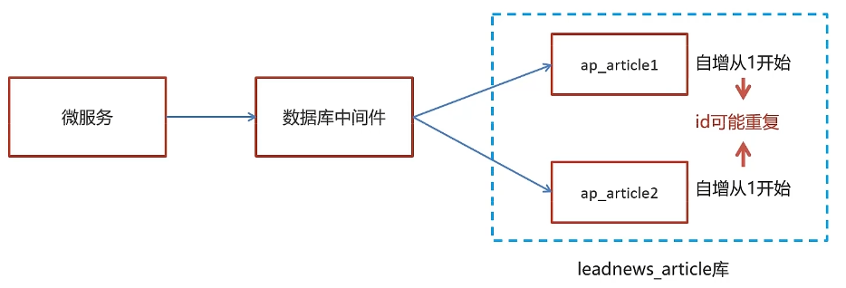
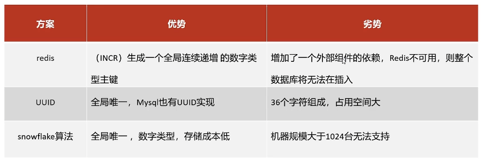

# 分布式ID

随着业务增长，我们需要使用数距库分片技术。将一个数距库经行拆分，通过数距库中间件连接。如果数距库中该表选用ID自增策略，则可能产生重复的ID,此时应该采用分布式ID生成策略来生成ID。



分布式id-技术选型



## 分布式id-雪花算法


# 实现雪花算法

mybatisplus自带雪花算法的实现，只需要在id字段上添加@TableId(value="id",type=IdType.ID_WORKER)

```java
@Data
@TableName("ap_article")
public class ApArticle implements Serializable {

    @TableId(value = "id",type = IdType.ID_WORKER)
    private Long id;
```

然后在配置文件中配置数据中心和机器id（建议在nacos上配置）：

```java
 # 为设置雪花算法配置数据中心id和工号id
mybatis-plus:  
  global-config:
    datacenter-id: 1
    workerId: 1
```

数据中心datacenter-id的取值范围为0-31，机器id取值范围0-31。配置完成后，插入数据会自动分配一个分布式独立的id
