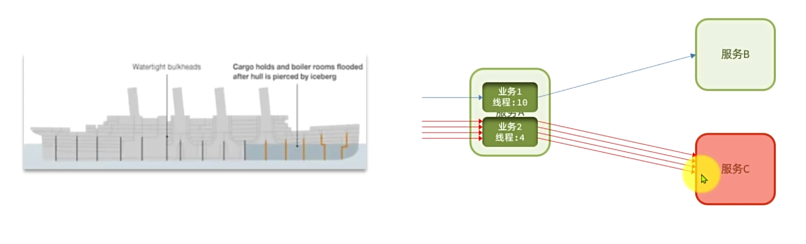

# 雪崩问题

微服务的调用链中的某个服务故障，引起整个链路中的所有微服务都不可用，这就是雪崩


级联服务宕机。


# 服务保护方案

## 请求限流

限制访问微服务的请求的并发量，避免服务因流量激增出现故障


## 线程隔离

也叫做船壁模式。通过限定每个业务能使用的线程数量而将故障业务隔离，避免故障扩散



## 服务熔断

由断路由器统计请求的异常比例或慢调用比例，如果超常阈值则会熔断该业务，拦截该接口的请求。

熔断期间，所有请求快速失败，全都走fallback逻辑。


# 服务保护技术


## 初识Sentinel

Sentinel是阿里巴巴开源的一款微服务流量控制组件。


1.下载jar包[https://github.com/alibaba/Sentinel/releases](https://github.com/alibaba/Sentinel/releases)，


2.运行，将jar包放在任意非中文目录下，重命名为sentinel-dashboard.jar

然后运行如下命令启动控制台：

```bash
java -Dserver.port=8090 -Dcsp.sentinel.dashboard.server=localhost:8090 -Dproject.name=sentinel-dashboard -jar sentinel-dashboard.jar
```

这里同样可以将sentinel部署在docker镜像中[sentinel镜像制作和部署](/docker配置/镜像/sentinel镜像制作.md)

3.微服务整合

在具体服务中引入依赖

```bash
<!--sentinel依赖-->
        <dependency>
            <groupId>com.alibaba.cloud</groupId>
            <artifactId>spring-cloud-starter-alibaba-sentinel</artifactId>
        </dependency>
```

配置application.yaml文件，添加如下内容：

```bash
spring:
  cloud:
    sentinel:
      transport:
        dashboard: 192.168.200.130:8090
```

## 簇点链路

就是单机调用链路。是一次请求进入服务后经过的每一个被Sentinel监控的资源链。默认Sentinel会监控SpringMVC的每一个EndPoint(http接口)。限流、熔断等都是针对链路中的资源设置的。而资源名默认就是接口的请求路径：


Restful风格的API请求路径一般都相同，这会导致簇点资源名称重复。因此我们需要修改配置，把请求方式+请求路径做为簇点资源名称：

```bash
spring:
  cloud:
    sentinel:
      transport:
        dashboard: 192.168.200.130:8090
      http-method-specify: true
```

## 请求限流

在簇点链路后面点击按钮，即可对其做限流配置：


## 线程隔离

 

保护服务其它线程的应用。

## Fallback

1.将FeignClient作为Sentinel的簇点资源(注意是在调用Feign接口的服务中配置)：

```bash
feign:
  sentinel:
     enabled: true
```

2.FeignClient的Fallback有两种配置方式

- 方式一：FallbackClass，无法对远程调用的异常做处理
- 方式二：FallbackFactory，可以对远程调用的异常做处理，通常都会选择这种。

### 步骤一

自定义类，实现FallbackFactory,编写对某个FeignClient的fallback逻辑：

```bash
@Slf4j
public class ItemClientFallbackFactory implements FallbackFactory<ItemClient> {
    @Override
    public ItemClient create(Throwable cause) {
        //创建ItemClient接口实现类，实现其中的方法，编写失败降级的处理逻辑

        return new ItemClient() {
            @Override
            public List<ItemDTO> queryItemByIds(Collection<Long> ids) {
                log.error("查询商品失败!",cause);
                return CollUtils.emptyList();
            }

            @Override
            public void deductStock(List<OrderDetailDTO> detailDTOS) {
                log.error("扣减商品库存失败!",cause);
                throw new RuntimeException(cause);
            }
        };
    }
}
```

在对应的Feign接口中添加相应的fallback注解：

```
@FeignClient(value = "item-service",fallbackFactory = ItemClientFallbackFactory.class)
```

最后在配置类配置ItemClientFallbackFactory的bean

```
public class DefaultFeignConfig {
    @Bean
public Logger.Level feignLoggerLevel(){
        return Logger.Level.FULL;
}

    @Bean
public RequestInterceptor userInfoRequestInterceptor(){
        return new RequestInterceptor() {
            @Override
public void apply(RequestTemplate requestTemplate) {
                Long user = UserContext.getUser();
if (user!=null){
                    requestTemplate.header("user-info", user.toString());
}
            }
        };
}

    @Bean
public ItemClientFallbackFactory itemClientFallbackFactory(){
        return new ItemClientFallbackFactory();
}
}
```

## 服务熔断

熔断降级是解决雪崩问题的重要手段。思路是由**断路器**统计服务调用的异常比例、慢请求比例，如果超出阈值则会熔断该服务。即拦截访问该服务的一切请求；而当服务恢复时，断路器会放行该服务的请求。


点击控制台中簇点资源后的熔断按钮，即可配置熔断策略：


## 分布式事务


## 分布式事务存在的问题

就一句话，不能保持数据的一致性，如果其中一个数距库更新数据出现问题。其它数据并并不回滚


### CAP定理

分布式系统的三个指标：

- Consistency（一致性）：用户访问分布式系统中的任意节点，得到的数据必须一致。
- Availability（可用性）：用户访问集群中的任意健康节点，必须能得到响应，而不是超时或拒绝。
- Partition tolerance（分区容错性）：
  - Partion（分区）：因为网络故障或其它原因导致分布式系统中的部分节点与其它节点失去连接，形成独立分区
  - Tolerance（容错）：在集群出现分区时，整个系统页要持续对外提供服务。

CAP定理：分布式系统无法同时满足这三个指标。


### BASE 理论

BASE理论时对CAP的一种解决思路，它包含三个思想：

- Basically Available（基本可用）：分区式系统出现故障时，允许损失部分可用性，即保证核心可用。
- Soft State（软状态）：在一定时间内，允许出现中间状态，比如临时的不一致状态。
- Eventually Consistent（最总一致性）：虽然无法保证强一致性，但是在软状态结束后，最终达到一致性

而分布式事务最大的问题是各个子事务的一致性问题，因此可用借鉴CPA定理和BASE理论：

- AP模式：各个事务分别执行和提交，允许出现结果不一致，然后采用弥补措施恢复数据即可，实现**最终一致**
- CP模式：各个子事务执行后相互等待，同时提交，同时回滚，达成**强一致**。但事务等待过程中，处于弱可用状态。

## Seata框架

seata事物中三个重要的角色：

- TC(Transaction Coordinator)-事务协调者：维护全局和分支事务的状态，协调全局事务或回滚。
- TM(Transaction Manager)-事务管理器：定义全局事务的范围、开始全局事务、提交或回滚全局事务。
- RM(Resource Manager)-资源管理器：管理分支事务处理的资源，与TC交谈以注册分支事务和报告分支事务的状态，并驱动分支事务提交或回滚。

Seata提供了四种不同的分布式事务解决方案：

- XA（eXtended Architecture）模式：强一致性分阶段事务模式，牺牲了一定的可用性，无业务侵入
- TCC模式：最终一致的分阶段事务模式，有业务侵入
- AT模式：最终一致的分阶段事务模式，无业务侵入，业式Seata的默认模式
- SAGA模式：长事务模式，有业务侵入。

## XA模式

XA规范是X/Open组织定义的分布式事务处理(DTP，Distributed Transaction Processing)标准，XA规范描述了全局的TM与局部的RM之间的接口，几乎所有主流数据库都对XA规范提供了支持。


### seata的XA模式

seata的XA模式做了一些调整，但大体上相似


- 优点：强一致性，实现简单
- 缺点：一阶段锁顶数距库资源，二阶段结束后才释放，性能较差

### 实现XA模式

Seata的starter已经完成了XA模式的自动装配，实现非常简单，步骤如下：

1. 修改application.yml文件（每个参与全局事务的微服务），开启XA模式：

```yml
seata:
	data-source-proxy-mode: XA
```

2. 给发起全局事务的入口方法添加@GlobalTransactional注解
