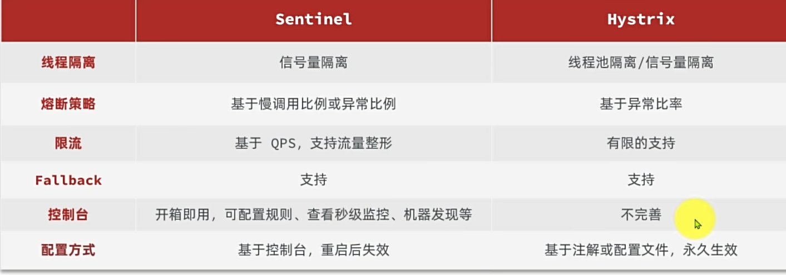

# 雪崩问题

微服务的调用链中的某个服务故障，引起整个链路中的所有微服务都不可用，这就是雪崩


级联服务宕机。


# 服务保护方案-请求限流

限制访问微服务的请求的并发量，避免服务因流量激增出现故障


# 服务保护方案-线程隔离

也叫做船壁模式。通过限定每个业务能使用的线程数量而将故障业务隔离，避免故障扩散


# 服务保护方案-服务熔断

由断路由器统计请求的异常比例或慢调用比例，如果超常阈值则会熔断该业务，拦截该接口的请求。

熔断期间，所有请求快速失败，全都走fallback逻辑。


# 服务保护技术



## 初识Sentinel

Sentinel是阿里巴巴开源的一款微服务流量控制组件。


1.下载jar包[https://github.com/alibaba/Sentinel/releases](https://github.com/alibaba/Sentinel/releases)，


2.运行，将jar包放在任意非中文目录下，重命名为sentinel-dashboard.jar

然后运行如下命令启动控制台：

```bash
java -Dserver.port=8090 -Dcsp.sentinel.dashboard.server=localhost:8090 -Dproject.name=sentinel-dashboard -jar sentinel-dashboard.jar
```
