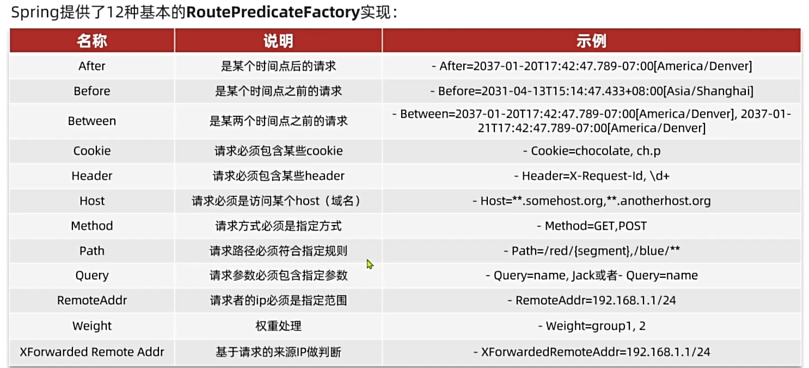
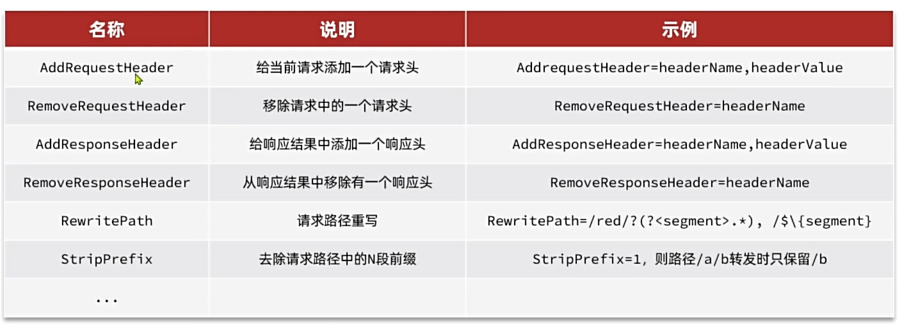
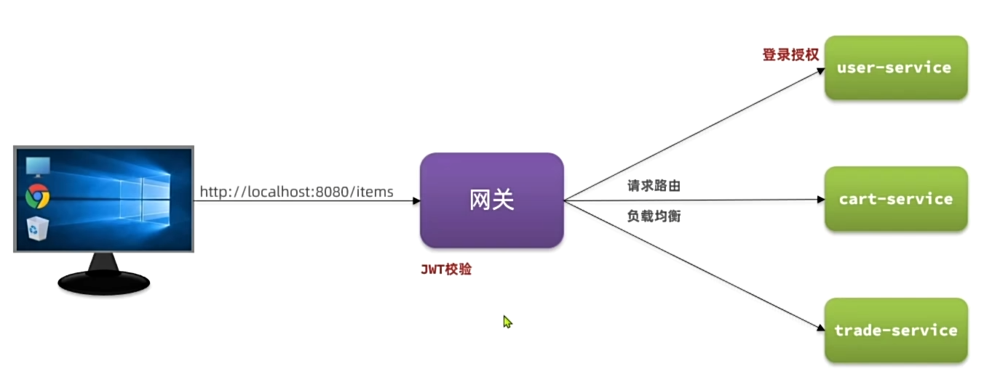
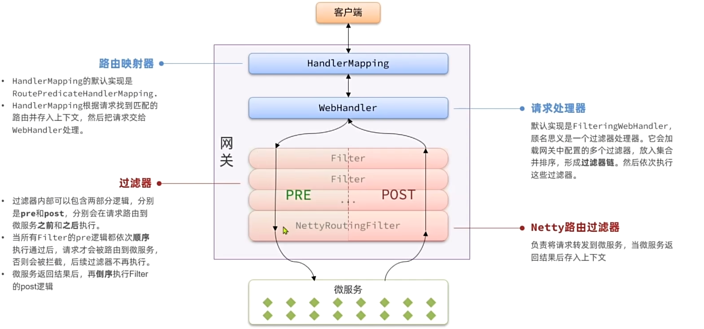
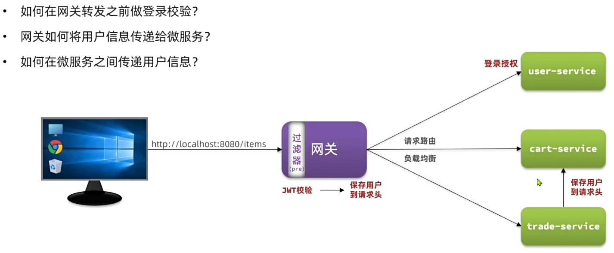
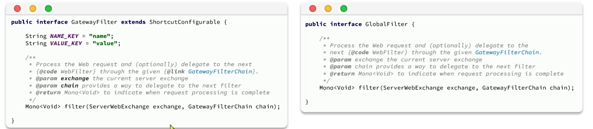
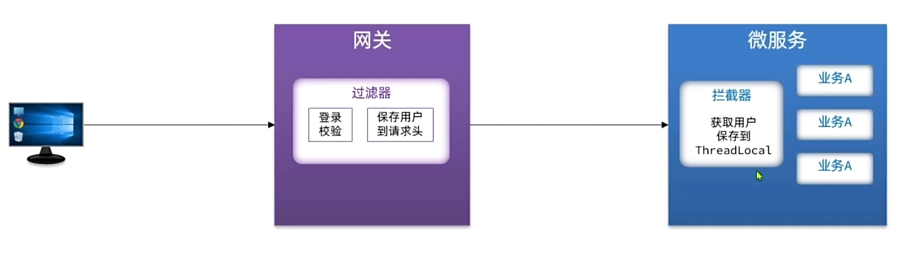
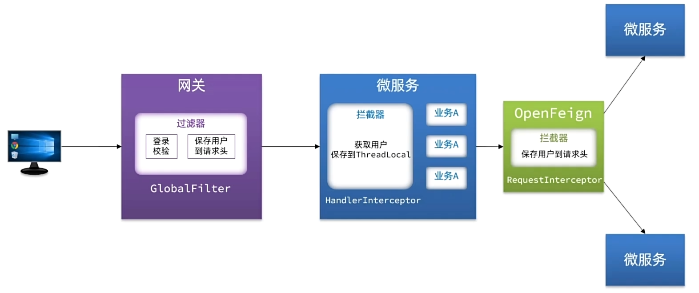

# 概述

网关：就是网络的关口，负责请求的路由、转发、身份校验。


在SpringCloud中网关的实现包括两种：

- Spring Cloud Gateway
  spring官方出品，基于WebFlux响应式编程，无需调优即可获得优异性能
- Nexfilx Zunl
  Netflix出品，基于Servlet的阻塞式编程，需要调优才能获得与SpringCloudGateway相似的性能

# 配置

1.创建模块

2.引入相关依赖

```
<!--网关-->
        <dependency>
            <groupId>org.springframework.cloud</groupId>
            <artifactId>spring-cloud-starter-gateway</artifactId>
        </dependency>
        <!--nacos discovery-->
        <dependency>
            <groupId>com.alibaba.cloud</groupId>
            <artifactId>spring-cloud-starter-alibaba-nacos-discovery</artifactId>
        </dependency>
        <!--负载均衡-->
        <dependency>
            <groupId>org.springframework.cloud</groupId>
            <artifactId>spring-cloud-starter-loadbalancer</artifactId>
        </dependency>
```

3.编写启动类

4.配置application.yaml文件

```
server:
  port: 8080
spring:
  application:
    name: hm-gateway
  cloud:
    nacos:
      server-addr: 192.168.200.130:8849
    gateway:
      routes:
        - id: item-service
          uri: lb://item-service #其中lb代表负载均衡
          predicates:
            - Path=/items/**,/search/**
        - id: user-service
          uri: lb://user-service
          predicates:
            - Path=/addresses/**,/users/**
        - id: trade-service
          uri: lb://trade-service
          predicates:
            - Path=/orders/**
        - id: pay-service
          uri: lb://pay-service
          predicates:
            - Path=/pay-orders/**
        - id: cart-service
          uri: lb://cart-service
          predicates:
            - Path=/carts/**


```

# 路由属性

网关路由对应的Java类型是RouteDefinition，其中常见的属性有：

- id：路由唯一表示
- uri：路由目标地址
- predicates：路由断言，判断请求是否符合当前路由
- filters：路由过滤器，对请求或响应做特殊处理

## 路由断言



## 路由过滤器



配置默认filter需要配置到与routes同级的位置

```
 routes:
        - id: item-service
          uri: lb://item-service #其中lb代表负载均衡
          predicates:
            - Path=/items/**,/search/**
        - id: user-service
          uri: lb://user-service
          predicates:
            - Path=/addresses/**,/users/**
        - id: trade-service
          uri: lb://trade-service
          predicates:
            - Path=/orders/**
        - id: pay-service
          uri: lb://pay-service
          predicates:
            - Path=/pay-orders/**
        - id: cart-service
          uri: lb://cart-service
          predicates:
            - Path=/carts/**
default-filters: 
   - AddRequestHeader=truth,anyone love me
```

# 网关登入校验

## 网关登入校验



网关请求处理流程



所以我们需要在过滤器之前加入JWT校验过滤



## 自定义全局过滤器（gateway过滤器，需要时则补充）

网关过滤器有两种，分别是：

- GatewayFilter：路由过滤器，作用于任意指定的路由；默认不生效，要配置到路由后生效。
- GlobalFilter：全局过滤器，作用范围是所有路由；声明后自动生效

两种过滤器的方法签名完全一致：



其中：

- ServerWebExchange exchange：请求上下文，包含整个过滤器链内共享数据，例如：request、response等
- GatewayFilterChain chain：过滤器链。当前过滤器执行完后，要调用过滤器链中的下一个过滤器

```
public class MyGlobalFilter implements GlobalFilter, Ordered {
    @Override
    public Mono<Void> filter(ServerWebExchange exchange, GatewayFilterChain chain) {
        //Todo 模拟登入校验
        ServerHttpRequest request = exchange.getRequest();
        HttpHeaders headers = request.getHeaders();
        System.out.println("headers:"+headers);
        return chain.filter(exchange);

    }

    @Override
    public int getOrder() {
        return 0; //值越小，过滤器的优先级越高
    }
}
```

为了保证我们自己的过滤器执行优先级最高，我们需要继承Ordered接口

# 实现登入校验

```java
@Component
@RequiredArgsConstructor
@Slf4j
public class AuthGlobalFilter implements GlobalFilter, Ordered {

    private final AuthProperties authProperties;
    private final JwtTool jwtTool;

    private final AntPathMatcher antPathMatcher = new AntPathMatcher();
    @Override
    public Mono<Void> filter(ServerWebExchange exchange, GatewayFilterChain chain) {
        ServerHttpRequest request = exchange.getRequest();
        //判断是否拦截
        if(isExclude(request.getPath().toString())){
            //放行
            return chain.filter(exchange);
        }

        String token = null;
        //获取token
        List<String> headers = request.getHeaders().get("authorization");
        if(headers!=null&&!headers.isEmpty()){
            token = headers.get(0);
        }
        Long userId = null;
        try {
            //校验token
            userId = jwtTool.parseToken(token);
        }catch (UnauthorizedException e){
            ServerHttpResponse response = exchange.getResponse();
            response.setStatusCode(HttpStatus.UNAUTHORIZED);
            return response.setComplete(); //到此终止了，不在转发
        }
        log.info("userId = "+userId);
        //传递用户信息


        return chain.filter(exchange);
    }

    private boolean isExclude(String path) {
        for (String excludePath : authProperties.getExcludePaths()) {
            if(antPathMatcher.match(excludePath,path)){
                return true;
            }
        }
        return false;
    }

    @Override
    public int getOrder() {
        return 0;
    }
}
```

# 网关传递用户



1.具体方法是把用户的信息存储在请求头中

```java
 //传递用户信息,通过添加请求头的方式
        ServerWebExchange swb = exchange.mutate()
                .request(builder -> builder.header("user-info", userInfo))
                .build();
```

2.在hm-common中编写SpringMVC拦截器，获取登入用户：由于每个微服务都可能获取登录用户的需求，因此可以直接在hm-common模块中定义拦截器

该拦截器由SpringMVC提供

```java
public class UserInfoInterceptor implements HandlerInterceptor {
    @Override
    public boolean preHandle(HttpServletRequest request, HttpServletResponse response, Object handler) throws Exception {
        //获取登入信息
        String userInfo = request.getHeader("user-info");
        if(StrUtil.isNotBlank(userInfo)){
            UserContext.setUser(Long.valueOf(userInfo));
        }

        return true;
    }

    @Override
    public void afterCompletion(HttpServletRequest request, HttpServletResponse response, Object handler, Exception ex) throws Exception {
         //清理用户
        UserContext.removeUser();
    }
}
```

要使SpringMVC的拦截器生效，我们需要配置在配置类中

```java
@Configuration
@ConditionalOnClass(DispatcherServlet.class) //排除网关,由于网关也会引用
public class MvcConfig implements WebMvcConfigurer {
    @Override
    public void addInterceptors(InterceptorRegistry registry) {
        registry.addInterceptor(new UserInfoInterceptor());
    }
}
```

又由于，不是每个微服务的启动类都能扫描到该配置类，因此我们还需要在resources/META-INF文件夹中，编写spring.factories(旧)来经行自动装配

```java
org.springframework.boot.autoconfigure.EnableAutoConfiguration=\
  com.hmall.common.config.MvcConfig
```


# OpenFeign传递用户

OpenFeign中提供了一个拦截器接口，所有由OpenFeign发起的请求都会先调用拦截器处理请求：

```java
 public RequestInterceptor userInfoRequestInterceptor(){
        return new RequestInterceptor() {
            @Override
            public void apply(RequestTemplate requestTemplate) {
                Long user = UserContext.getUser();
                if (user!=null){
                    requestTemplate.header("user-info", user.toString());
                }
            }
        };
    }
```

这样就可以将服务内请求的header中添加用户信息


# 总解决方案


