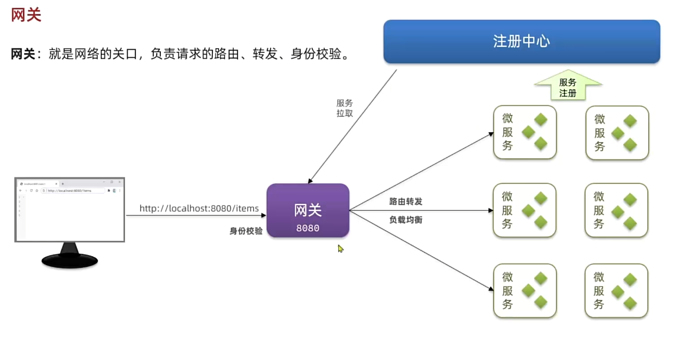

# 概述

网关：就是网络的关口，负责请求的路由、转发、身份校验。



在SpringCloud中网关的实现包括两种：

- Spring Cloud Gateway
  spring官方出品，基于WebFlux响应式编程，无需调优即可获得优异性能
- Nexfilx Zunl
  Netflix出品，基于Servlet的阻塞式编程，需要调优才能获得与SpringCloudGateway相似的性能

# 配置

1.创建模块

2.引入相关依赖

```
<!--网关-->
        <dependency>
            <groupId>org.springframework.cloud</groupId>
            <artifactId>spring-cloud-starter-gateway</artifactId>
        </dependency>
        <!--nacos discovery-->
        <dependency>
            <groupId>com.alibaba.cloud</groupId>
            <artifactId>spring-cloud-starter-alibaba-nacos-discovery</artifactId>
        </dependency>
        <!--负载均衡-->
        <dependency>
            <groupId>org.springframework.cloud</groupId>
            <artifactId>spring-cloud-starter-loadbalancer</artifactId>
        </dependency>
```

3.编写启动类

4.配置application.yaml文件
