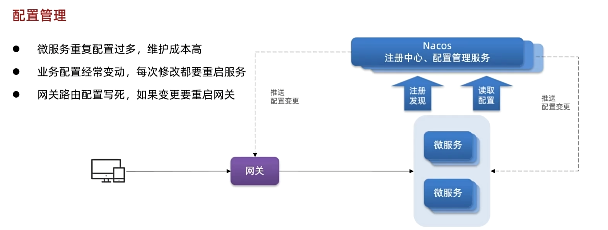
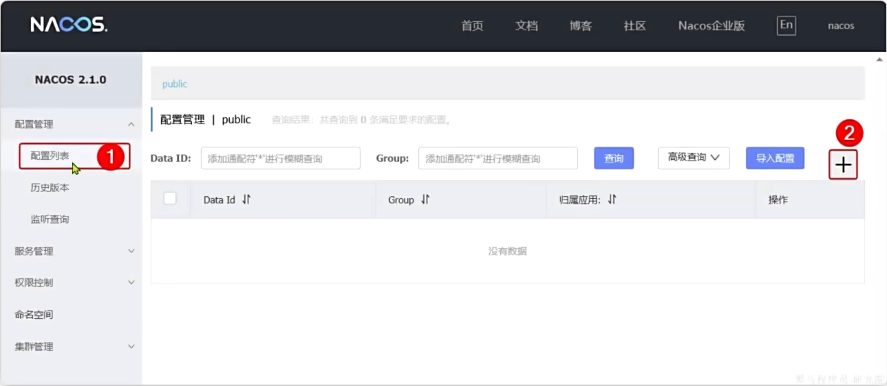
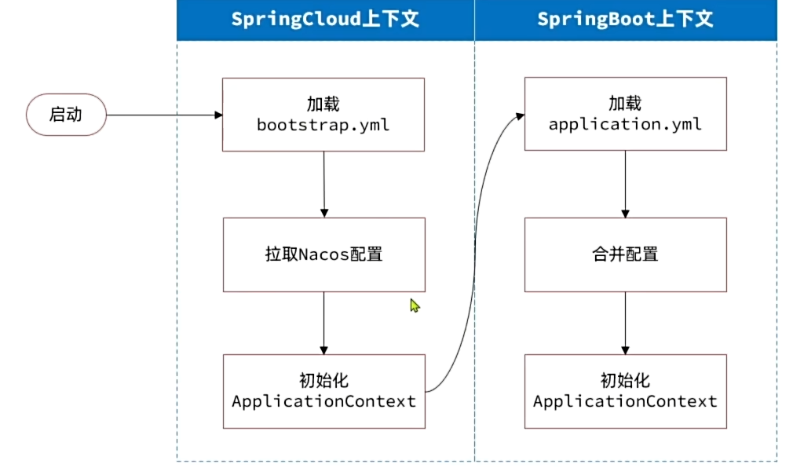
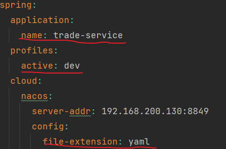
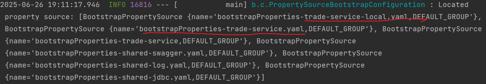
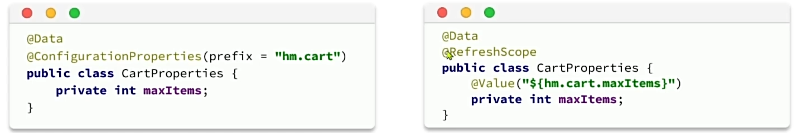

# 配置管理



# 配置共享

1. 添加配置到Nacos
   添加一些共享配置到Nacos中，包括：jdbc、MybatisPlus、日志、Swagger、OpenFeign等配置



1.配置共享的shared-jdbc.yaml文件

```
spring:
  datasource:
    url: jdbc:mysql://${hm.db.host:192.168.200.130}:${hm.db.port:3307}/${hm.db.database}?useUnicode=true&characterEncoding=UTF-8&autoReconnect=true&serverTimezone=Asia/Shanghai
    driver-class-name: com.mysql.cj.jdbc.Driver
    username: ${hm.db.un:root}
    password: ${hm.db.pw:123456}
mybatis-plus:
  configuration:
    default-enum-type-handler: com.baomidou.mybatisplus.core.handlers.MybatisEnumTypeHandler
  global-config:
    db-config:
      update-strategy: not_null
      id-type: auto
```

2.配置共享的shared-log.yaml文件

```
logging:
  level:
    com.hmall: debug
  pattern:
    dateformat: HH:mm:ss:SSS
  file:
    path: "logs/${spring.application.name}"
```

3.配置共享的shared-swagger.yaml文件

```
knife4j:
  enable: true
  openapi:
    title: ${hm.swagger.title:黑马商城接口}
    description: ${hm.swagger.desc:黑马商城接口}
    email: zhanghuyi@itcast.cn
    concat: 虎哥
    url: https://www.itcast.cn
    version: v1.0.0
    group:
      default:
        group-name: default
        api-rule: package
        api-rule-resources:
          - ${hm.swagger.package}
```

# 配置文件的拉取

基于NacosConfig拉取共享配置代替微服务的本地配置



1.引入依赖

```
<!--nacos配置管理-->
        <dependency>
            <groupId>com.alibaba.cloud</groupId>
            <artifactId>spring-cloud-starter-alibaba-nacos-config</artifactId>
        </dependency>
        <!--读取bootstrap文件-->
        <dependency>
            <groupId>org.springframework.cloud</groupId>
            <artifactId>spring-cloud-starter-bootstrap</artifactId>
        </dependency>
```

2.配置bootstrap.yaml文件

```

```

# 配置热更新

当修改配置文件中的配置时，微服务无需重启即可使配置生效

这需要设置前提条件：

1. nacos中要有一个与微服务名有关的配置文件

   

   可以看到，在配置bootstrap时，这三个元素刚好组成了上述所需的配置文件格式，因此当现目一启动它就会自动去寻找对应的项目文件。

   

   上图可以看到，启动服务时同时加载了trade-service-local.yaml和trade-service.yaml文件
2. 微服务中要以特定方式读取需要热更新的配置属性



推荐使用方法1

# 动态路由

要实现动态路由首先要将路由配置保存到Nacos中，当Nacos中的路由配置变更时，推送最新配置到网关，实时更新网关中的路由信息。

1. 监听Nacos配置变更的消息
2. 当配置变更时，将最新的路由信息跟新到网关路由表中

## 监听Nacos配置

编写配置类

```
package com.hmall.gateway.routes;


import cn.hutool.json.JSONUtil;
import com.alibaba.cloud.nacos.NacosConfigManager;
import com.alibaba.nacos.api.config.listener.Listener;
import com.alibaba.nacos.api.exception.NacosException;
import lombok.RequiredArgsConstructor;
import lombok.extern.slf4j.Slf4j;
import org.springframework.cloud.gateway.route.RouteDefinition;
import org.springframework.cloud.gateway.route.RouteDefinitionWriter;
import org.springframework.stereotype.Component;
import reactor.core.publisher.Mono;

import javax.annotation.PostConstruct;
import java.util.HashSet;
import java.util.List;
import java.util.Set;
import java.util.concurrent.Executor;

@Slf4j
@Component
@RequiredArgsConstructor
public class DynamicRouteLoader {

    private final NacosConfigManager nacosConfigManager;
    private final RouteDefinitionWriter routeDefinitionWriter;

    private Set<String> routeIds = new HashSet<>();

    private final String dataId = "hm-gateway-routes.json";
    private final String group = "DEFAULT_GROUP";

    @PostConstruct //在bean初始化后执行
    public void initRouteConfigListener() throws NacosException {
        //1.项目启动时，先拉取一次配置，并且添加配置监听器
        String configInfo = nacosConfigManager.getConfigService()
                .getConfigAndSignListener(dataId, group, 5000, new Listener() {
            @Override
            public Executor getExecutor() {
                return null;
            }

            @Override
            public void receiveConfigInfo(String configInfo) {
                //2.监听到配置变更，需要去更新路由表
                updateConfigInfo(configInfo);
            }
        });
        //3.第一次读取时，也需要更新路由表
        updateConfigInfo(configInfo);

    }

    public void updateConfigInfo(String configInfo) {
        log.debug("监听到路由配置信息：{}",configInfo);

        //1.解析配置文件，转为RouteDefinition
        List<RouteDefinition> routeDefinitions = JSONUtil.toList(configInfo, RouteDefinition.class);
        //2.删除旧的路由表
        for (String routeId : routeIds) {
            routeDefinitionWriter.delete(Mono.just(routeId)).subscribe();
        }

        //3.跟新路由表
        for (RouteDefinition routeDefinition : routeDefinitions) {
            //3.1 跟新路由表
            routeDefinitionWriter.save(Mono.just(routeDefinition)).subscribe();
            routeIds.add(routeDefinition.getId());
        }


    }
}

```

在nacos中配置与下面本地配置等价的json配置文件，方便程序的读取使用

- 原配置

```
spring:
  application:
    name: hm-gateway
  cloud:
    nacos:
      server-addr: 192.168.200.130:8849
    gateway:
      routes:
        - id: item-service
          uri: lb://item-service #其中lb代表负载均衡
          predicates:
            - Path=/items/**,/search/**
        - id: user-service
          uri: lb://user-service
          predicates:
            - Path=/addresses/**,/users/**
        - id: trade-service
          uri: lb://trade-service
          predicates:
            - Path=/orders/**
        - id: pay-service
          uri: lb://pay-service
          predicates:
            - Path=/pay-orders/**
        - id: cart-service
          uri: lb://cart-service
          predicates:
            - Path=/carts/**
```

- 等价的json配置，在nacos上
  ```
  [
      {
          "id": "item-service",
          "predicates": [
              {
                  "name": "Path",
                  "args": {"_genkey_0": "/items/**", "_genkey_1": "/search/**"}
              }
          ],
          "filters": [],
          "uri": "lb://item-service"
      },
      {
          "id": "user-service",
          "predicates": [
              {
                  "name": "Path",
                  "args": {"_genkey_0": "/addresses/**", "_genkey_1": "/users/**"}
              }
          ],
          "filters": [],
          "uri": "lb://user-service"
      },
      {
          "id": "trade-service",
          "predicates": [
              {
                  "name": "Path",
                  "args": {"_genkey_0": "/orders/**"}
              }
          ],
          "filters": [],
          "uri": "lb://trade-service"
      },
      {
          "id": "pay-service",
          "predicates": [
              {
                  "name": "Path",
                  "args": {"_genkey_0": "/pay-orders/**"}
              }
          ],
          "filters": [],
          "uri": "lb://pay-service"
      },
      {
          "id": "cart-service",
          "predicates": [
              {
                  "name": "Path",
                  "args": {"_genkey_0": "/carts/**"}
              }
          ],
          "filters": [],
          "uri": "lb://cart-service"
      }
  ]
  ```
